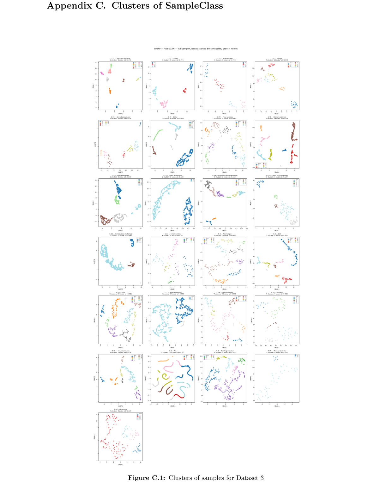
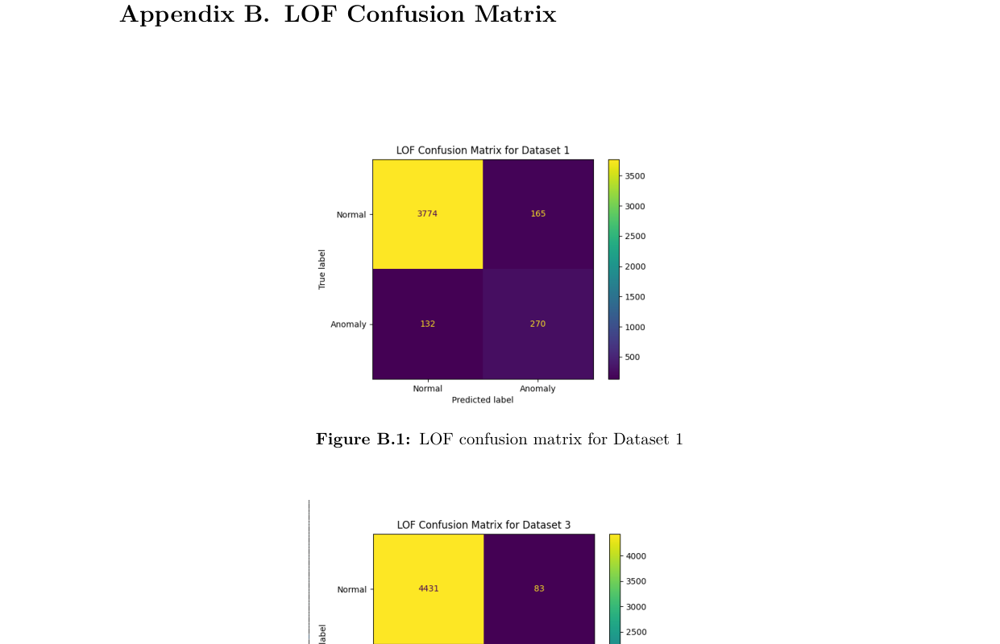
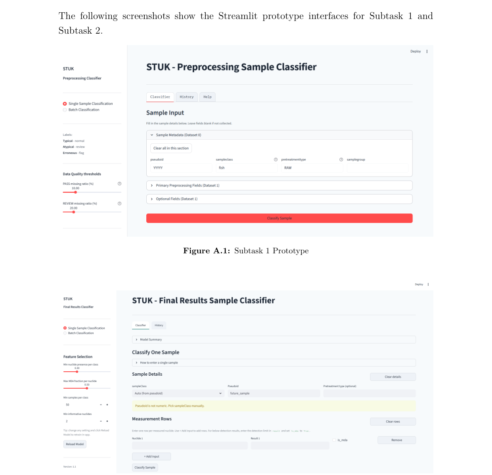

# Detection of Anomalies from Gamma Radiation Measurement Data

**University of Helsinki — Master's Programme in Data Science**
**Authors:** Yee Hui Min, Joonas Honkavaara, Kim Rosqvist, Ofia Rahman Alif, Mahfuzur Rahman

An automated anomaly detection system built for STUK (the Radiation and Nuclear Safety Authority of Finland), which collects tens of thousands of environmental samples each year (fish, soil, water, milk, and more) and manually enters radioactivity measurements into a database. Manual entry introduces the risk of errors and unusual values from atypical samples — this project automates the detection of those anomalies.

---

## Overview

The project covers the full pipeline from raw data to deployable classifiers:

1. **Data cleaning** of three linked STUK datasets (sample metadata, preprocessing properties, and radioactive measurement results).
2. **Clustering** (nine algorithms evaluated, including autoencoder-based clustering, HDBSCAN, GMM, and more) to surface structure and candidate outliers.
3. **Expert validation** — flagged samples were reviewed by STUK domain experts to confirm genuine anomalies.
4. **Supervised model training** using the validated labels to build two **Local Outlier Factor (LOF)** classifiers — one for sample preprocessing metadata, one for measurement results.
5. **Deployment** as Jupyter notebooks (for integration into STUK's pipeline) and two interactive Streamlit applications.

Each model classifies incoming samples into one of three categories: **Typical**, **Atypical**, or **Erroneous/Exceptional**.

---

## Tech Stack

| Purpose | Tools |
|---|---|
| Data handling | Python, Pandas, NumPy |
| Visualisation | Matplotlib, Seaborn |
| Modelling | scikit-learn (LOF, Isolation Forest, HBOS, One-Class SVM, clustering algorithms), UMAP, HDBSCAN |
| Notebooks | Jupyter |
| Interactive apps | Streamlit |
| Collaboration | Git/GitHub, Discord, Microsoft Teams, Google Docs |

---

## Data

Three linked datasets were provided by STUK, covering environmental samples (fish, lichen, gravel, water, milk, air, etc.) collected near Finnish nuclear power plants and monitoring stations such as Hyytiälä:

- **Dataset 0** — sample metadata (sample class, pretreatment type, sample group).
- **Dataset 1** — physical/preprocessing properties (net weight, density, geometry, drying/ashing/vaporisation flags, etc.).
- **Dataset 3** — radioactive measurement results (nuclide, activity/MDA, unit, measurement uncertainty).

Cleaning addressed placeholder rows, physical-constraint violations (e.g. gross weight < tare weight), nuclide name standardisation (383 → 344 canonical names, including correcting two STUK-confirmed typos), and unit consolidation. After STUK-confirmed removals (derived quantities, software-artefact negative values, garbage nuclide names, physically impossible values, etc.), Dataset 3 was reduced from 98,300 to 96,936 rows across 23,161 samples.

---

## Clustering

Nine clustering algorithms — K-Means, Spectral Clustering, DBSCAN, OPTICS, HDBSCAN, GMM, Agglomerative Clustering, Mean Shift, and an Autoencoder + K-Means approach — were evaluated to find structure ahead of supervised anomaly detection.

**Key findings:**
- Sample **processing workflow** (e.g. RAW vs. DRY→VAP→ASH) was a stronger discriminating signal in Dataset 1 than sample class alone.
- Autoencoder-based clustering and HDBSCAN performed best on Dataset 1.
- For Dataset 3, UMAP + HDBSCAN was applied independently per sample class (25 of 41 classes met inclusion criteria, covering 65.6% of samples), identifying 2–10 clusters per class with silhouette scores from 0.23–0.80.
- A soil cluster showed Cs-137 at 4.6× the class median with suppressed natural radionuclide levels — consistent with anthropogenic contamination.

  

<i>Figure: UMAP + HDBSCAN clustering of sample classes in Dataset 3, sorted by silhouette score.</i>

---

## Model Selection

Four candidate models were benchmarked: **Isolation Forest**, **Local Outlier Factor (LOF)**, **Histogram-Based Outlier Score (HBOS)**, and **One-Class SVM**.

Isolation Forest was tested in detail as an initial candidate (500 estimators, contamination = 0.02) but only correctly flagged 33% of known anomalies as Erroneous/Exceptional (ROC-AUC 0.75), struggling with subtler deviations.

**Local Outlier Factor (LOF)** was ultimately selected as the primary model, achieving the best anomaly detection accuracy among the candidates.

---

## Results

| Dataset | Overall Accuracy | Normal F1 | Anomaly F1 |
|---|---|---|---|
| Dataset 1 (Preprocessing) | **93.16%** | 96.21% | 64.52% |
| Dataset 3 (Measurements) | **92.97%** | 96.10% | 64.50% |

Anomaly-class performance on Dataset 3 was harder to improve due to the high variability of radioactive measurement data across sample classes and nuclide combinations.

  

<i>Figure: LOF confusion matrices for Dataset 1 (preprocessing) and Dataset 3 (measurement results).</i>

---

## Deliverables

1. **Jupyter notebooks** documenting the full pipeline (cleaning → clustering → model training → evaluation), intended as the primary handover artefact for integration into STUK's existing internal tooling.
2. **Two Streamlit web applications** for analysts who prefer an interactive interface over running code directly:
   - **Subtask 1 app** — Preprocessing sample classifier, with configurable data-quality thresholds (PASS / REVIEW / BLOCKER) before classification.
   - **Subtask 2 app** — Measurement results classifier, exposing nuclide-selection hyperparameters and supporting in-app retraining.

Both apps share a common structure: a sidebar for configuration, a Classifier tab (single-sample entry or CSV batch upload), and a History tab logging every run as a downloadable JSON file. Results are shown on colour-coded cards (green / amber / red for Typical / Atypical / Erroneous) with supporting charts and per-feature diagnostics.

  

<i>Figure: Streamlit prototype interfaces — Subtask 1 (Preprocessing Sample Classifier) and Subtask 2 (Final Results Sample Classifier).</i>

---

## Challenges & Future Work

- **No verified ground truth** existed up front; STUK's manual validation introduced delays of up to a month before confirmed labels were available for calibration.
- Evaluating nine clustering algorithms without ground truth to guide comparison added roughly two weeks to the timeline.
- **Future directions:** use a larger manually validated anomaly list for proper model calibration, explore additional ML models for the measurement-results task, and build out the existing UI further to remove the need for analysts to run code directly.

---

## Repository Structure

---

## Full Report

See [`report.pdf`](./report.pdf) for the complete write-up, including detailed cleaning rules, all nine clustering methods, full LOF pipeline configuration, and additional appendices (prototype screenshots, confusion matrices, and per-sample-class cluster plots).
